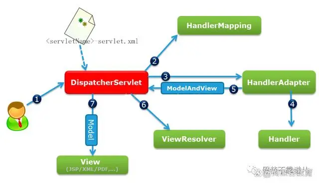

# 1 常见设计模式

单例、工厂、代理、策略、责任链、建造者、观察者、装饰器、适配器、模板

单例：单例是在整个应用程序环境中只会存在一份对象，分为饿汉式单例模式和懒汉式单例模式，饿汉式是在类初始化的时候将所有的单例对象全部生成，而懒汉式是在使用的时候才会生成对象。

工厂：工厂是通过给一个工厂类传入指定参数来实例化一个对象，它与策略设计模式类似，但是工厂更侧重的是对象的实例化，比如生成的对象是猫还是狗。

代理：代理是对原始类进行增强，比如在原始类的方法执行前后进行一些操作。它分为静态代理和动态代理，静态代理是在编译期间就已经生成代理类，而动态代理是在运行期间生成代理类，静态代理的缺点是每个代理类只能代理一个原始类，而动态代理可以代理多个原始类。

策略：策略通过给一个策略类传入指定参数来决定处理的逻辑，它与工厂设计模式相比，更侧重的是逻辑的处理，比如支付方式应该选择支付宝还是微信。

责任链：责任链是将一个请求按照一定的顺序交给多个处理器来进行处理，每个处理器都可以对其进行处理或者传递给链上的下一个处理器。

建造者：建造者是将一个复杂对象的创建分解为多个简单的对象一步一步构建而成，它注重方法的调用顺序，它还将变与不变相分离，即产品的组成部分是不变的，但每一部分是可以灵活选择的。

观察者：观察者由成为发布订阅模式，是在对象之间定义一种一对多的依赖关系，当一个对象的状态发生改变时，所有依赖于它的对象都会得到通知并自动更新。

装饰器：装饰器是在不改变原始类的情况下，对原始类进行增强，比如在原始类的方法执行前后进行一些操作，它有点类似代理模式，但是代理模式做的额外处理跟原始方法没有关系，比如权限控制日志打印，而装饰器则是对原始方法进行扩展添加额外的功能。

适配器：适配器是将一个类的接口转换成客户希望的另一个接口，它使得原本由于接口不兼容而不能一起工作的那些类可以一起工作，比如写一个适配器类，然后实现一个目标接口，同时持有一个需要适配的适配者类对象。通过适配器类的中间转换实现了适配器类与目标接口的兼容。

模板：模板是在一个抽象类中定义了执行它的方法模板，它的子类可以按照需要重写方法进行实现，但具体的使用将以抽象类中定义的方式进行。

# 2 SpringMVC处理请求的流程

  
1、客户端（浏览器）发送请求，DispatcherServlet拦截请求。

2、DispatcherServlet根据请求信息调用HandlerMapping。HandlerMapping根据URL去匹配查找能处理的Handler（也就是我们平常说的Controller控制器），并会将请求涉及到的拦截器和Handler一起封装。

3、DispatcherServlet调用HandlerAdapter适配器执行Handler，在执行Handler之前会先执行前置拦截器preHandle处理，执行完Handler之后会执行后置拦截器postHandle处理。

4、Handler完成对用户请求的处理后，会返回一个ModelAndView对象给DispatcherServlet，ModelAndView顾名思义，包含了数据模型以及相应的视图的信息。Model是返回的数据对象，View是个逻辑上的View。

5、ViewResolver会根据逻辑View查找实际的View。

6、DispaterServlet把返回的Model传给View（视图渲染），然后执行拦截器的最终操作afterCompletion处理。

7、把View返回给请求者（浏览器)。

# 3 Spring里的AOP
AOP（Aspect Oriented Programming）指的是面向切面编程，通过预编译方式和运行期动态代理实现在不修改源代码的情况下给程序动态统一添加某种特定功能的一种技术，可以实现比如日志记录、事务管理、性能统计和权限控制等功能。SpringAOP是基于动态代理来实现的，它分为两种代理方式，一种是JDK动态代理，一种是CGLIB动态代理。如果要代理的对象，实现了某个接口，那么 Spring AOP 会使用 JDK动态代理去创建代理对象，而对于没有实现接口的对象，就无法使用 JDK动态代理去进行代理，这时候 Spring AOP 会使用 Cglib动态代理 生成一个被代理对象的子类来作为代理。JDK动态代理的底层是使用反射生成一个实现目标类接口的代理类，而Cglib动态代理是使用字节码技术将目标类加载进来通过修改字节码来生成代理类。

# 4 Spring AOP 和 AspectJ AOP 有什么区别

**Spring AOP 属于运行时增强，而 AspectJ 是编译时增强。** Spring AOP 基于动态代理来实现的，而 AspectJ 基于字节码操作来实现的。如果我们的切面比较少，那么两者性能差异不大。但是，当切面太多的话，最好选择 AspectJ ，它比 Spring AOP 快很多。

# 5 Spring IoC和DI

**IoC（Inversion of Control） 控制反转**，是一种设计思想，而不是一个具体的技术实现，IoC 的思想就是将原本在程序中手动创建对象的控制权，交由 Spring 框架来管理。将对象之间的相互依赖关系交给 IoC 容器来管理，并由 IoC 容器完成对象的注入。这样可以很大程度上简化应用的开发，把应用从复杂的依赖关系中解放出来。 IoC 容器就像是一个工厂一样，当我们需要创建一个对象的时候，只需要配置好配置文件或注解即可，完全不用考虑对象是如何被创建出来的。IoC 容器实际上就是个 Map（key，value），Map 中存放的是各种对象，而这些由IoC容器管理的对象又称之为Bean。**DI（Dependency Injection）依赖注入**，IoC就是通过依赖注入来实现的，通过注入的方式将IoC容器中的对象赋值给目标属性。依赖注入有三种方式：

1、属性注入：通过在目标属性上加@Autowired注解来实现。

2、setter注入：在目标属性的set方法上添加@Autowired注解来实现。

3、构造方法注入：通过在构造函数上添加@Autowired注解来实现，**如果当前类中只有一个构造方法，那么 @Autowired 也可以省略**

属性注入使用起来简单但是无法注入final 修饰的对象；setter注入相比较属性注入，同样不能注入一个final修饰的对象，但是被注入的对象在注入前可以被修改；使用构造方法注入可以注入final修饰的对象，同时被注入的对象在注入前可以被修改；

# 6 @Autowired和@Resource注解的区别

二者都是用来实现依赖注入的。但是，

@Autowired是Spring提供的注解，支持属性注入、setter注入、构造方法注入，注入的对象是通过类型进行查找的，如果一个类型存在多个Bean再根据名称进行查找；

@Resource是JDK提供的注解，只支持属性注入、setter注入，注入的对象是通过名称进行查找的，如果通过名称没有找到会再通过类型进行查找。

# 7 SpringBoot的自动装配

SpringBoot的自动装配指的是在Springboot的帮助下通过一些少量注解或简单的配置就可以完成第三方依赖的注入，减少了配置第三方依赖的麻烦。使用方式就是在第三方依赖的META-INF文件中创建一个spring.factories文件，其中写入当前依赖中配置类的全类名，之后再主项目中引入这个依赖就可以通过注解的方式注入这个依赖来使用，因为主项目的SpringBootApplication注解包含有EnableAutoConfiguration注解来启动自动配置，EnableAutoConfiguration注解中的Import注解会去读取整个项目中包含第三方依赖中的spring.factories文件中的配置类。

# 8 SpringBoot的启动流程

运行main方法，启动springboot程序，会先new一个SpringApplication对象，在对象的构造方法中会进行一些参数的初始化工作。运行run方法，读取环境变量、配置信息等等，然后创建SpringApplication上下文，执行prepareContext方法将启动类作为配置类读取，将所有的配置类注册为BeanDefinition，之后执行refresh方法加载ioc容器，执行invokeBeanFactoryPostProcessor方法解析@Import注解，加载所有的自动配置类，之后执行onRefresh方法加载内置的Servlet容器创建一个内置的Tomcat，在这个过程中springboot会调用很多的监听器对外进行扩展。

# 9 SpingBean的生命周期

整体来说生命周期分为实例化->属性赋值->初始化->使用->销毁五个阶段，但是有其他的扩展如下：

1、BeanDefinition：Bean容器找到Bean并且将Bean的定义加载进容器里。

2、postProcessBeanFactory()：对BeanDefinition进行后处理。

3、postProcessBeforeInstantiation()：执行实例化之前的方法。

4、实例化：Bean容器通过反射将Bean定义实例化。

5、postProcessAfterInstantiation()：执行实例化之后的方法。

6、属性赋值：对Bean实例里面的属性进行赋值。

7、setBeanName()：设置Bean的名称。

8、setBeanFactory()：设置BeanFactory。

9、postProcessBeforeInitialization()：执行后置Bean处理中的初始化之前的方法。

10、初始化：调用afterPropertiesSet()初始化Bean对象。

11、init-method：自定义的init方法。

12、postProcessAfterInitialization()：执行后置Bean处理中的初始化之后的方法。

13、使用：使用初始化完成的Bean对象。

14、销毁：调用destroy()方法销毁Bean对象。

15、destroy-method：自定义的destroy方法。

